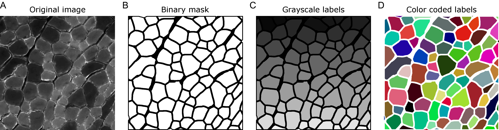
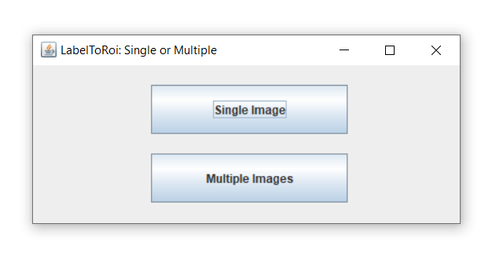
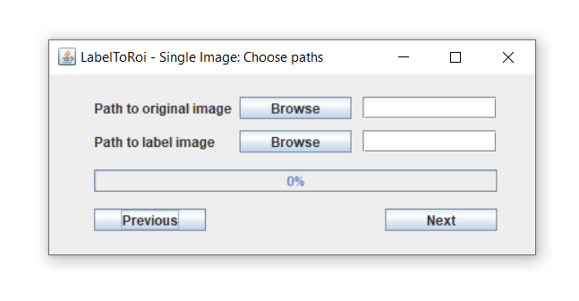
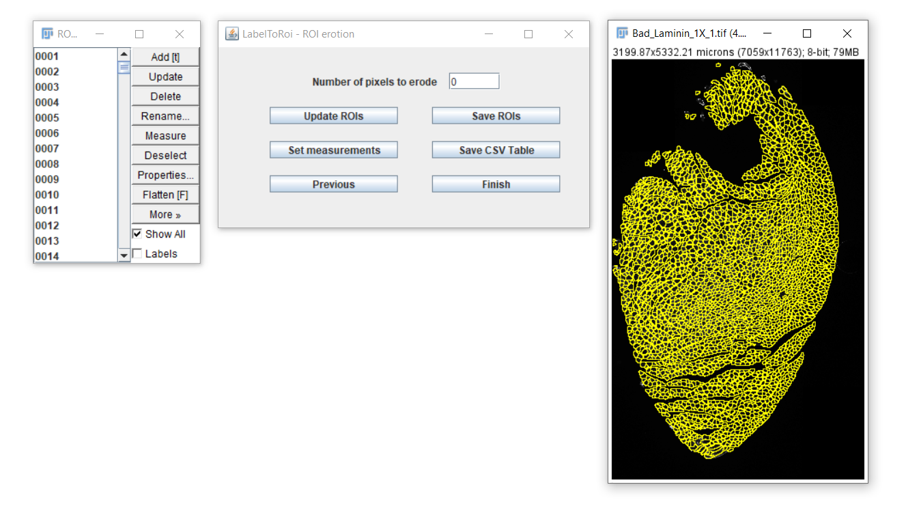
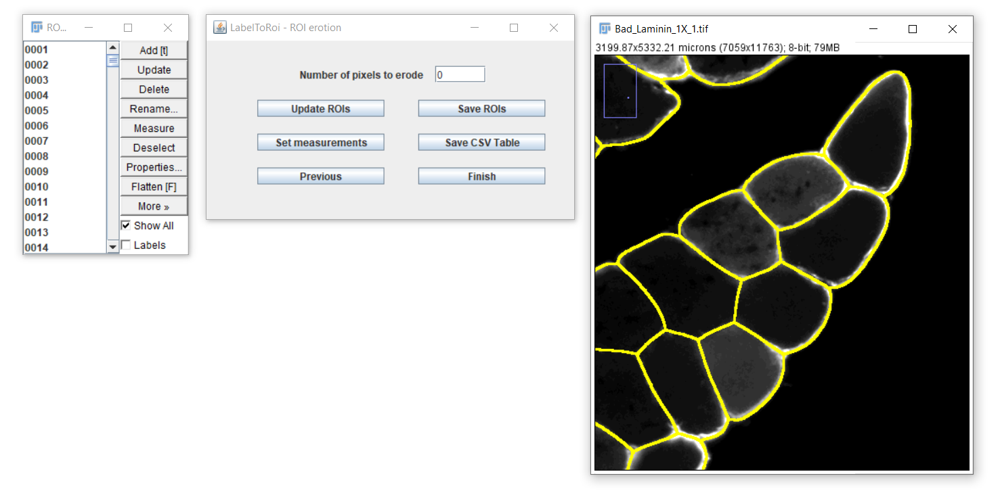
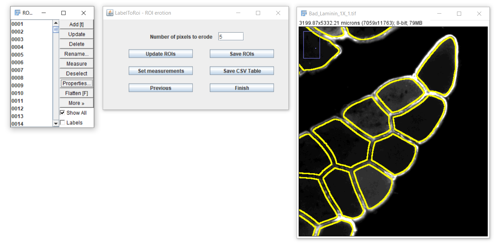
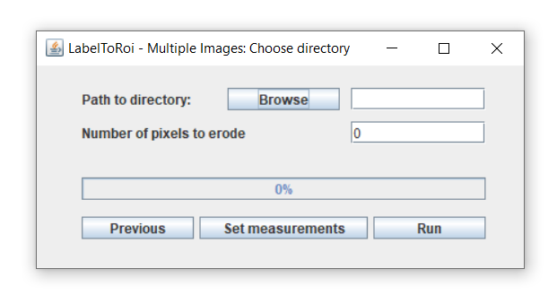
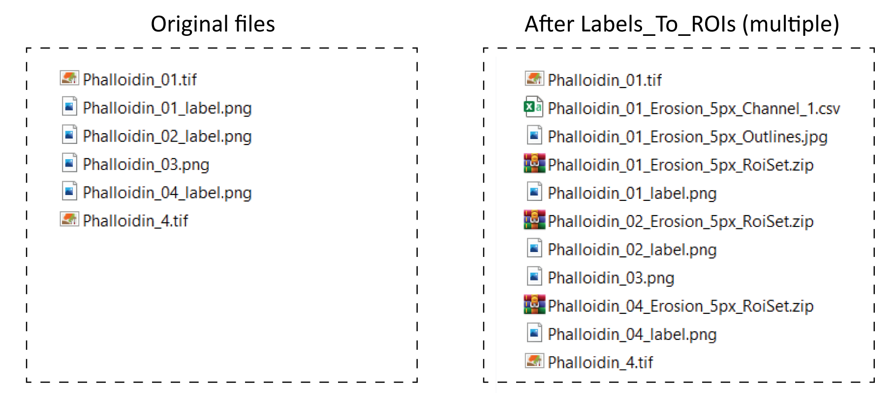

# LabelToROis

Labels\_To\_ROIs

**Labels\_To\_ROIs documentation**

Labels\_To\_ROIs is a FIJI/imageJ plugin that provides the tools to generate the regions of interest (ROIs) from label images. It also allows to adjust the size of these ROIs and to generate measurements from the original images in the different channels.

**Why this plugin?**

There have been many recent machine learning tools described for image segmentation and object detection that work astoundingly well, and probably much more to come. In many cases, these algorithms generate their output in the form of labeled images. For a computer scientist or a user well versed in image analysis using programming languages such as Python or MATLAB, the use of label images is common practice, and thus they can rapidly incorporate these algorithms to their everyday routines. However, other users without this specific knowledge are significantly more limited in taking advantage of these developmentstools.

FIJI/ImageJ is a powerful and user-friendly image analysis software widely adopted in the biological community. Within FIJI/ImageJ, the Regions of Interest (ROIs) are an effective way to identify objects prior to making different analyses. However, there is currently no easy nor efficient way for transforming the information stored in label images to ROIs. The objective of this plugin is to provide an easy to use tool to accomplish this.

**Brief introduction to label images**

When analyzing images in biology, it is often desired to identify certain objects to generate specific measurements that can be later analyzed in detail. Whether these objects are cells, nuclei or other structures, a common strategy is to generate binary image masks where the objects of interest are distinguished from everything else by assigning two different colors to the pixels: either black for the background or white for the foreground (Fig. 1A,B). Then, it is fairly simple to use these binary masks as references to make, for instance, area or intensity measurements in the original image. In many cases, these binary images are created through an intensity threshold after staining the cells or tissues with specific dyes or antibodies that recognize the object of interest. It is important to note that the objects in these images can only be identified among each other because they are not connected, i.e., there are black pixels separating them.

Figure 1. (A) Example of a laminin staining in a PFA fixed cross section of mouse skeletal muscle. (B) Binary mask corresponding to the myofibers. (C-D) Labels generated from the binary mask in grayscale (C) or with color coded labels (D).

Another way of identifying objects in images is by labelling them with unique identifiers. Here, instead of all objects having the same color (white), each of them has a specific color that distinguishes it from the rest (Fig. 1C). This is especially useful for objects that are touching each other, and thus do not have any black background in between. Usually, label images are grayscale images, either of 8 or 16 bits, depending on the number of objects they have. For example, an 8-bit image has 256 different shades of gray, ranging from black to white. Thus, considering the background with value equals to 0, an 8-bit label image can store up to 255 objects. Similarly, a 16-bit image can store up to 65,535 objects. It is important to note that the pixel value of the objects in the label image works as an identifier and nothing else. Thus, to make the visualization of label images easier one can assign random colors to each object (Fig. 1D).

**How to use Labels\_To\_ROis**

There are two basic ways to use this plugin:

1. **Single image**

Generates ROIs from a single label image, with or without the original image. Allows to erode/dilate the ROIs by a specific pixel value and to dynamically update them, save them and generate measurements as CSV tables.

1. **Multiple images**

Generates and automatically saves the ROIs for multiple label images. It allows to erode/dilate them by a specific pixel value. If the original images are also provided, it generates table measurements, which are automatically saved as CSV files.

1. **Single image**

After choosing the &quot;Simple image&quot; button from the main menu, a new window dialog is displayed.

Here, a label image must be selected using the browse button. The label image can be either in &quot;PNG&quot; or &quot;TIF&quot; format. Optionally, the original image corresponding to that label can be provided. The label and original images must have the same pixel resolution. If an original image is included, after pressing the &quot;Next&quot; button this image will be opened. The ROIs will begin populating the image and the progress can be followed through the progress bar. If only a label image is chosen, this image will be opened, and the ROIs will be displayed here. The time for this task to be completed highly depends on the image resolution and the number of objects to be converted to ROIs.

After completing, a new dialog will become visible.

In this dialog you will be able to:

1. Erode/dilate the ROIs
2. Save the ROIs
3. Generate measurements and save them as CSV files.

**Erosion or dilation of ROIs**

In some cases, the ROIs have to be slightly eroded/dilated to accurately identify the boundaries of the object of interest. This is particularly important when measuring the area or other associated measurements. To erode the ROIs, enter a specific pixel value in the text field and click on the &quot;Update ROIs&quot; button.

_Useful note__: to easily navigate and inspect the image, you can zoom in or zoom out with Ctrl/Cmd &quot;+&quot; or &quot;-&quot;, after selecting the image. To move from the current field of view, you can press the keyboard space bar and the cursor will change into a hand, allowing you to move from that view after clicking and dragging on the image._

After clicking the &quot;Update ROIs&quot; button, the modified ROIs will be displayed on the image. Different erosion values can be visually assessed, or you can return to the original ROIs by setting the pixel value to 0. To dilate the ROIs, enter a negative pixel value.

**Saving ROIs and images with outlined ROIs**

After modifying the ROIs as desired, you can save them by clicking the &quot;Save ROIs&quot; button. The ROIs file will be saved in the same location as the original image. The file will be named after the original image, if available, with the addition of the following substring at the end: &quot;\_Erosion\_0px\_RoiSet.zip&quot;. For example, for an original image named Phalloidin\_01.tif with a 5-pixel erosion, the ROI file will be &quot;Phalloidin\_01\_Erosion\_5px\_RoiSet.zip&quot;. This file can later be opened again with the FIJI/ImageJ&#39;s ROI Manager.

Additionally, a JPG image with the outlined ROIs will be saved to the same location following this naming scheme: &quot;Phalloidin\_01\_Erosion\_5px \_Outlines.jpg&quot;.

**Generating and saving measurements**

To generate table measurements, a shortcut to the Set Measurements dialog is added as a button. In most of the cases, this only makes sense if an original image is included. After selecting the desired measurements, you can click on the &quot;Save CSV Table&quot; button. If the image does not have a spatial calibration (i.e., an indication of the actual pixel distance in micrometers), a warning prompt will indicate this, which is particularly important when area or spatial measurements are intended. To note, a table with the measurements will be saved regardless of calibration. This table will also include the following columns, which are meant to simplify subsequent analyses in other platforms:

| **Column name** | **Description** |
| --- | --- |
| **File** | The name of the original image file |
| **Channel** | The channel measured |
| **Pixels\_eroded** | The number of eroded pixels from the ROIs |
| **Spatial\_calibration** | A Boolean of True or False indicating if the image was spatially calibrated |

The table/s will be automatically saved to the same location as the original file, with the addition of the following substring &quot;\_Erosion\_0px\_Channel\_1.csv&quot;. For the example above, with 5-pixel erosion, the name of the table for channel 1 will be &quot;Phalloidin\_01&quot;\_Erosion\_0px5px\_Channel\_1.csv&quot;. If the original image has multiple channels, then multiple tables will be saved, one for each channel.

1. **Multiple images**

The LabelsToROIs plugin also allows to generate ROIs from multiple image labels. After clicking on the &quot;Multiple Images&quot; button in the main dialog, a new dialog will be displayed. Here, you can browse for a specific location where the label images and, optionally, the original images are located.

In this case, all the label images must be stored in the same folder and must contain the substring &quot;\_label.png&quot; or &quot;\_label.tif&quot; at the end of the filename. If the user also wants to automatically generate measurements from the associated original images, these should also be included in the same folder as the label images. Importantly, the original image should be a TIF file whose filename must be the same as for the label image, except for the &quot;\_label.png&quot; or &quot;\_label.tif&quot; (see examples below).

After correctly saving all the images with their appropriate filenames within the same directory, the user should browse for that specific location with the browse button.

An important consideration is that all images analyzed in batch will be subjected to the same erosion/dilation, which can be indicated in the text field. Thus, it is important to previously explore the amount of erosion/dilation appropriate for that set of images by analyzing a representative image in the &quot;Single image&quot; pipeline.

In case an original image is also included, a CSV table will also be created for each specific channel. The different desired measurements can be indicated with the shortcut to the Set Measurements dialog.

After clicking the &quot;Run&quot; button, the progress of the processing can be visualized with the progress bar. In this case, the images will not be displayed. The ROI files as well as the CSV tables will be saved to the same input directory, following the same naming scheme as indicated in the &quot;Single image&quot; section. Additionally, JPG images with the outlined ROIs will also be automatically saved.

As an example, in the figure below there is a set of example images used to run the multiple images routine, the files created after running the plugin, as well as a table explaining the outcome for each label.

| **Original image** | **Label Image** | **Result** | **Comments** |
| --- | --- | --- | --- |
| Phalloidin\_01.tif | Phalloidin\_01\_label.png | ROIs and CSV table saved | Original and label image included |
| - | Phalloidin\_02\_label.png | Only ROIs saved | Original image not included |
| **-** | Phalloidin\_03.png | Nothing | Wrong naming scheme |
| Phalloidin\_4.tif | Phalloidin\_04\_label.png | Only ROIs saved | Names not matching |

3
